 

  

<table>
<tr>

<td align="center" width="25%">
💻 
<b>Programming</b> 
Python • C • C++ • Java
</td>

<td align="center" width="25%">
🧠 
<b>Computer Science</b> 
DSA • OOP • DBMS • OS
</td>

<td align="center" width="25%">
📊 
<b>Data Science & ML</b> 
NumPy • Pandas • Scikit-learn
</td>

<td align="center" width="25%">
🚀 
<b>Projects</b> 
Learning by building
</td>

</tr>
</table>

 

<code>&gt; sql &gt; query()</code>

  

  

📍 Chennai, Tamil Nadu, India &nbsp;•&nbsp; One project at a time

 

---

## 👋 About Me

I'm **Amber**, a student building my foundation across **programming, computer science, data, and machine learning**.

I'm familiar with **Python, C, C++, Java, and SQL**, while strengthening my understanding of **Data Structures, OOP, DBMS, and Operating Systems**.

Currently, I'm focusing on **Python, SQL, Data Science, and Machine Learning** through hands-on projects and experimentation.

---

## 🧠 What I'm Exploring

<table>
<tr>

<td width="50%" valign="top">

### 💻 Programming & CS

- Python
- C / C++
- Java
- Data Structures & Algorithms
- Object-Oriented Programming
- DBMS & SQL
- Operating Systems
- Problem Solving

</td>

<td width="50%" valign="top">

### 📊 Data Science & Machine Learning

- NumPy
- Pandas
- Matplotlib
- Scikit-learn
- Data Analysis
- Data Visualization
- Machine Learning fundamentals
- Working with datasets

</td>

</tr>
</table>

---

## 🛠️ Tech Stack

### Languages

### Data Science/ML Tooling

### Data Visualization / BI

### Databases & Backend

### Tools & Deployment

---

## 🚀 Featured Project

### 🐍 100 Days of Python

`Python` `Automation` `Data` `APIs` `Project-Based Learning`

A collection of projects built while working through **100 Days of Code: The Complete Python Pro Bootcamp** by **Dr. Angela Yu**.

The repository documents my progress from Python fundamentals toward more practical applications.

🔗 **[View Repository →](https://github.com/Amber821200/100-DAYS-OF-PYTHON)**

---

## 📊 GitHub Analytics

 

---

## 🐍 Contribution Activity

---

### **Learn → Build → Experiment → Break → Fix → Repeat**

*This profile is a work in progress — just like my skills.*

 

